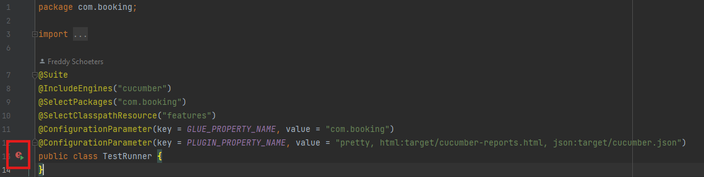
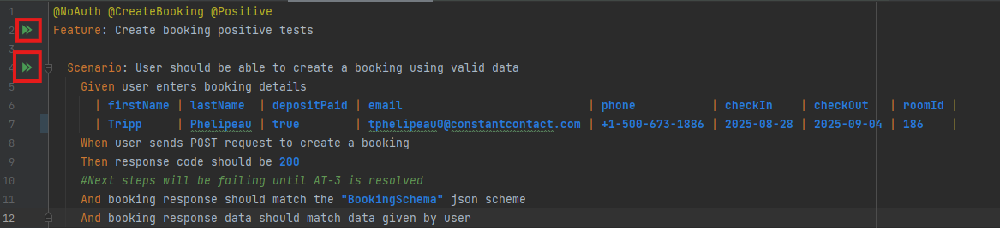
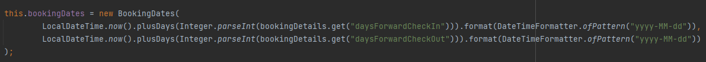

# Kata API Testing in Java

This project implements test automation framework for RESTful API based on Java and its most popular libraries. At current stage of implementation it covers scenarios of creating a booking and fetching booking details by booking ID.

## 1. Overview

Framework is built based on BDD approach using scenarios written in plain English, making it easier for non-technical members of the team to participate in product development.

- API URL - https://automationintesting.online/.
- Auth Swagger - https://automationintesting.online/auth/swagger-ui/index.html
- Booking Swagger - https://automationintesting.online/booking/swagger-ui/index.html

## 2. Technologies utilized

- Java 17 - programming language
- Maven 4.0.0 - build library
- Rest Assured 5.5.2 - API testing library
- JSON Schema Validator 5.5.5 - JSON validation util library
- Cucumber 7.22.2 - BDD framework
- JUnit Jupiter 5.12.2 - Test library
- JUnit Platform Suite 1.12.2 - Test discovery and test execution infrastructure
- Lombok 1.18.38 - Annotations to reduce default code
- GSON 2.11.0 - JSON manipulation library

## 3. Features Covered

Following end-points are covered by the current implementation of the framework

### 1. auth-controller
- POST - Login
- POST - Validate
- POST - Logout

### 2. booking-controller
- GET - Get booking details by booking ID
- POST - Create a booking

## 5. Setup guide

- Install Java 17 and Maven 4.0.0 or above.
- Clone the repository
- Open project in the IDE
- Let project build
- Reload Maven project if needed

## 6. Run configurations

Tests can be executed using different approaches:
### 1. TestRunner class
Using this class you can execute all existing tests 

### 2. Feature files
In /src/test/resources there is a /features package which contains two other packages: 
- /negative package contains all negative tests which are supposed to verify how API reacts to incorrect behaviour. 
- /positive package contains all positive tests which are supposed to verify API behaviour under normal conditions, a.k.a. happy-path.

Both packages contain .feature files and inside of them you can see features and scenarios to execute a single test or a whole feature suite.

### 3. Maven command
If both previous options do not fit you, you can always rely on Maven commands:
- If you want to execute all tests just run "mvn clean test"
- If you want to execute a specific group of tests you can always add "-Dcucumber.filter.tags={}" option 

Available cucumber filter tags:
- @Auth and @NoAuth - based on test requirements for authentication
- @Positive and @Negative - based on tests' purpose
- @InvalidID, @NonExistentID and @InvalidData - based on different types of negative tests
- @GetBookingById and @CreateBooking - based on API feature/endpoint

### !IMPORTANT!
In current implementation room ID or booking dates have to be changed after each run in .feature files. 
Even though I could easily implement some kind of randomizer for room ID (as I did for booking ID), my understanding of the business side of the application suggests that there are always limited number of rooms. 
So using random room IDs would not fit. Also, it is possible to implement additional logic for booking dates. 
For example, we can retrieve int value of 'daysForward' for both checkin and checkout, then process them using LocalDateTime class and format back to String to save in our custom Booking class.
Implementation would look something like this:

## 7. Reporting

Cucumber HTML report can be accessed at /target/cucumber-reports.html

## 8. Test scenarios

- Create booking positive scenario
- Create booking negative scenario (contains 13 scenarios depending on input data)
- Get booking by booking ID positive scenario
- Get booking by booking ID negative scenario

## 9. Open issues

All open issues (observations) have reports which are located in /src/resources/observation.
Each observation report has screen recording link attached and some of them have example payload json to make reproducing it easier.
Also, please note that some tests have comments related to observation status.

- AT-1 - Swagger "Try it out" feature returns 404 on all requests
- AT-2 - Auth logout request returns 404
- AT-3 - Create booking POST request does not return booking data
- AT-4 - User is able to create a booking with check-in date in the past
- AT-5 - Get booking by booking ID returns incorrect response
- AT-6 - Get booking by invalid booking ID returns incorrect error response
- AT-7 - User is able to create a booking without phone number or email
- AT-8 - Update and delete booking by invalid booking ID returns incorrect error response
- AT-9 - Update booking by valid booking ID returns error response
- AT-10 - Delete booking by valid booking ID returns error response
- AT-11 - Get booking by non-existent booking ID returns incorrect error response
- AT-12 - Update and delete booking by non-existent booking ID returns incorrect error response
- AT-13 - Update booking using invalid data returns wrong error response
